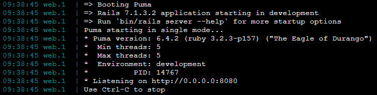
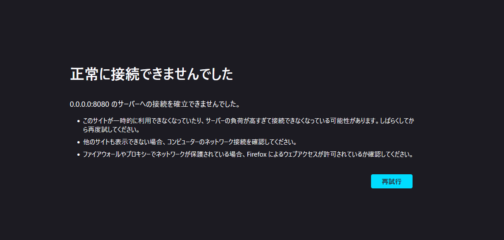
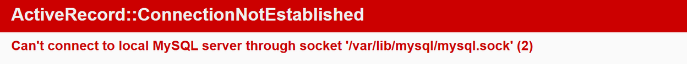

## 第三回課題

### サンプルアプリケーションの実行画面

### 今回実行したアプリケーションの AP サーバーの名前とバージョン

Puma Ver 6.4.2

###DB サーバーの名前とバージョン

MySQL Ver 8.4.4 for Linux on x86_64

###AP サーバーを終了させた場合、引き続きアクセスできるか

アクセスできない事を確認した。

### DB サーバーを終了させた場合、どうなるか

エラーが発生してアクセスが出来なくなる事を確認した。

### AP サーバーについて

- Web3 層構造と呼ばれる Web システムの中間に位置するプログラムを動作させるサーバーのこと。WEB サーバー、AP サーバー、DB サーバーの 3 つで構成される。
- ユーザーの HTTP リクエストを**WEB サーバー**が受け取り、次に WEB サーバーからの要求を受けて**AP サーバー**がプログラミング言語による処理を行う。その後、**DB サーバー**に対してデータ処理を要求する。

### DB サーバーについて

- システムが取り扱うデータを一元管理し、AP サーバーからの要求に基づいてデータの保存や更新などを行うデータベースを構築するために運用・管理を行うシステム

### Rails の構成管理ツールの名前は何だったか

- **Bundler**を利用して、Gem と呼ばれる外部ライブラリをまとめてインストールできる。
  

### 今回の課題から学んだこと

DB サーバーのソケットファイルのパスや yarn の導入・バージョンの違いなどに躓きながら環境構築の複雑さを感じましたが、同時にエラー内容を 1 文ずつ丁寧に確認していくことの重要さと、アプリケーションが無事に起動した際の達成感も学ぶことができました。
