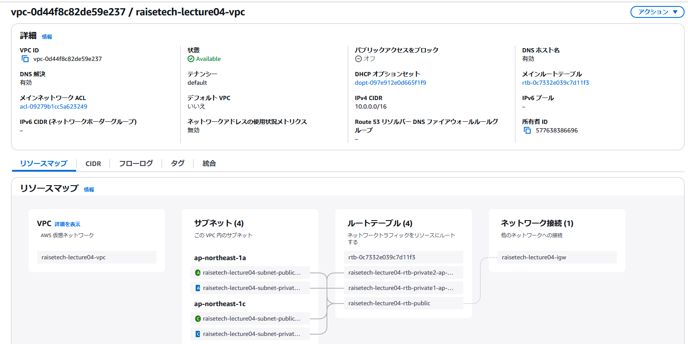
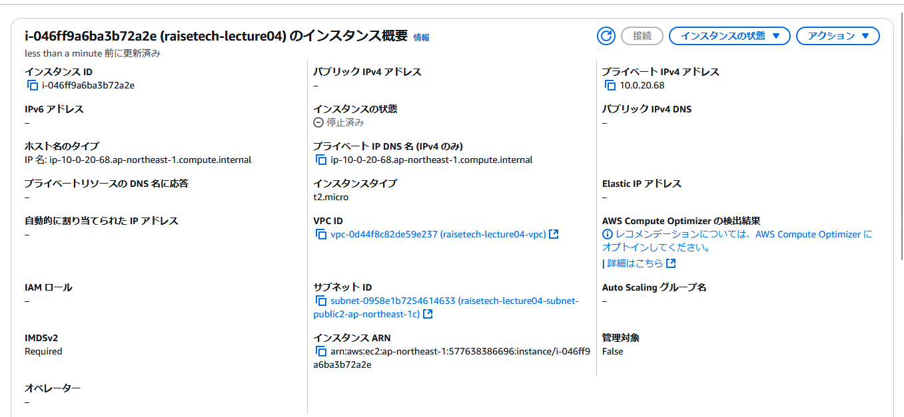
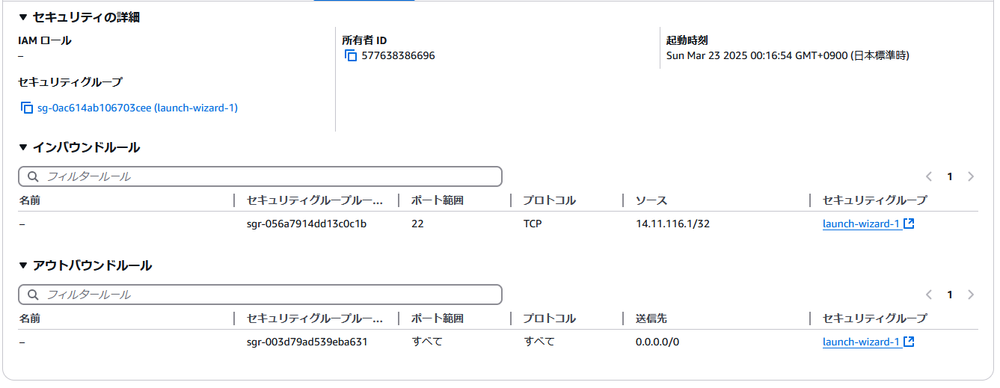
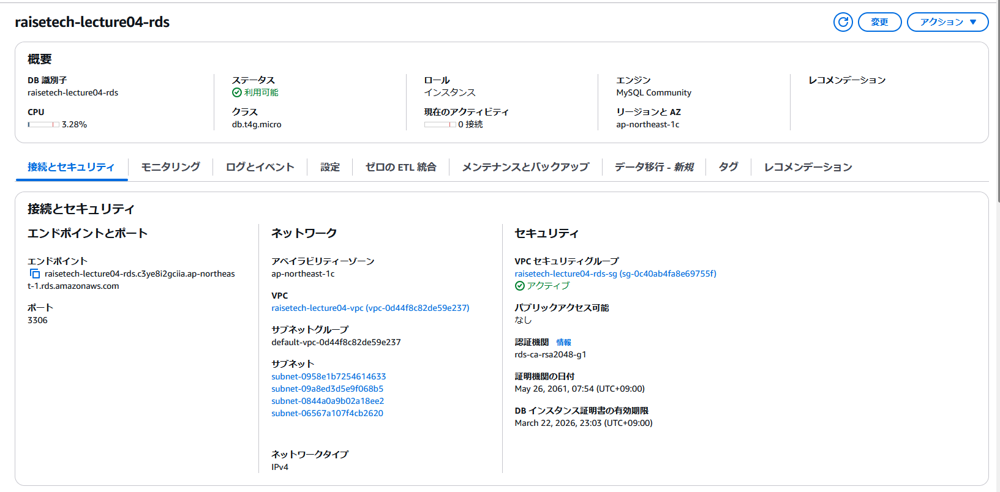
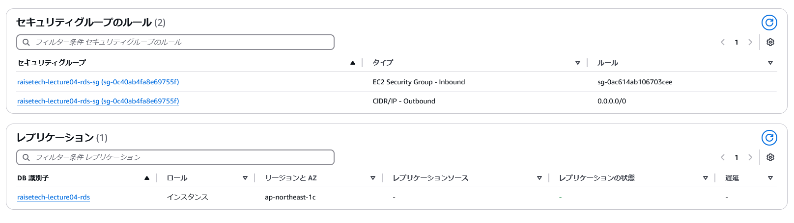
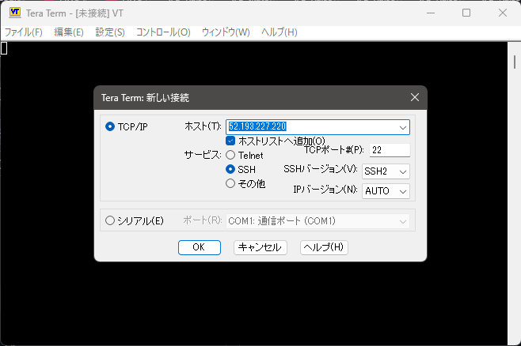
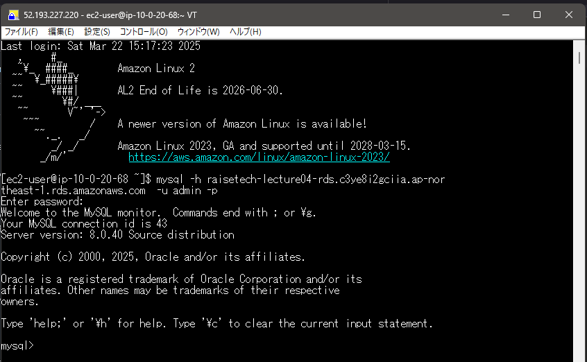

# 第 4 回課題

## VPC の作成

## EC2 の作成

## EC2 のセキュリティグループ

## RDS の作成

## RDS のセキュリティグループ

## EC2 から RDS へ接続

- Tera Term を用いて EC2 のパブリック IP を指定し、.pem を読み込ませて EC2 に接続した。
    

- MySQL をインストールし、下記画像の通り MySQL を起動した。
  

## 感想

- EC2 のウィザードからセキュリティグループを新規作成しようとすると、自分で名前を決められず launch-wizard-01 で作成されてしまった。次回からは先に SG を作成してから EC2 を作成する手順をとりたい。
- EC2 作成時に AZ を指定しても強制的に ap-northeast-1c に作成されるという事態に陥った（1a を指定していた）。調べてみたところ AWS 側の都合でインスタンスの作成に制約がかかるケースがあるとのこと。今回は RDS を同じ AZ に配置して対応した。
